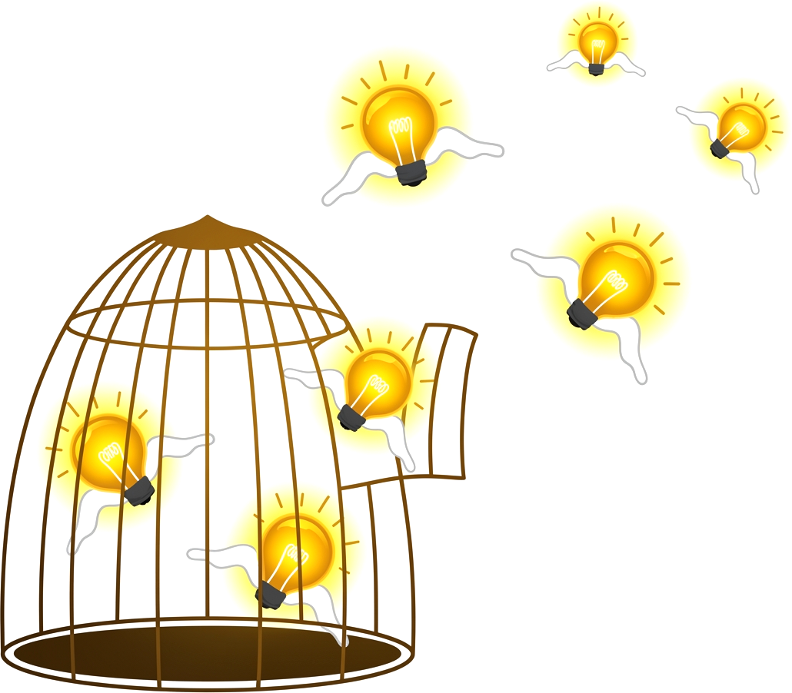
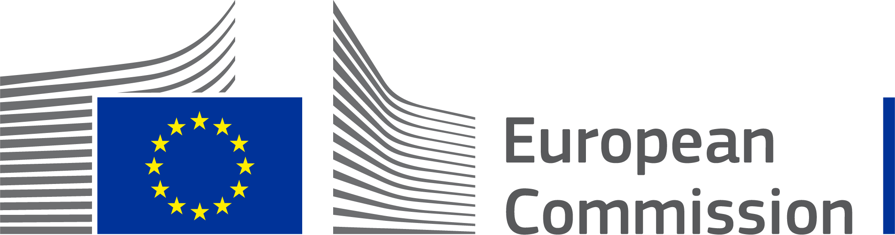
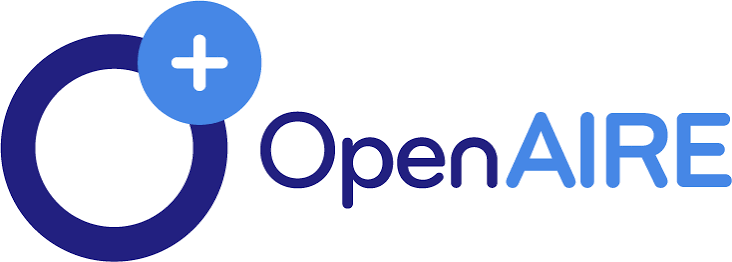
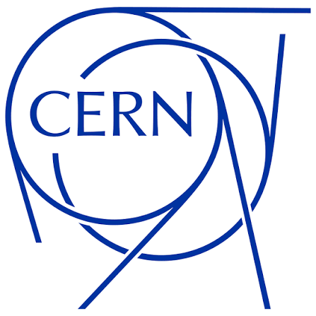
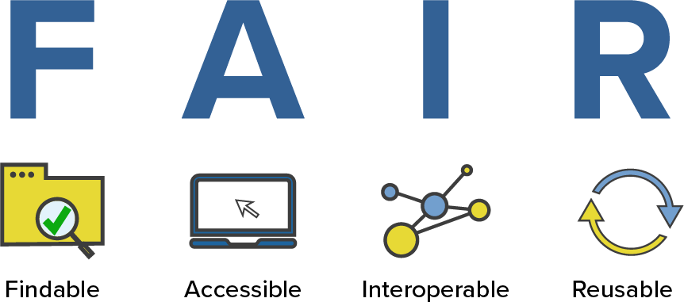
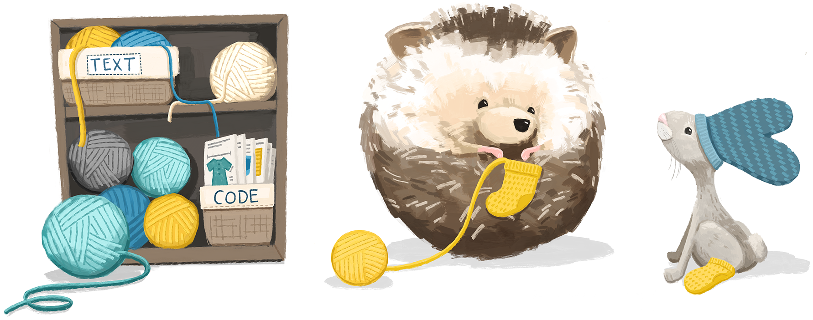

## Oiê! 👋 {.smaller}

```{r}
#| label: setup
#| include: false

library(here)
library(rutils) # github.com/danielvartan/rutils

source(here("R", "_setup.R"))
```

::::: {.columns}
:::: {.column style="width: 50%; font-size: 0.85em;"}
Esta apresentação fala sobre o Zenodo, um repositório universal para todos os tipos de pesquisa acadêmica.

::: {style="padding-top: 15px;"}
Aqui estão os tópicos principais:

1. **O que é?**
1. **Por que usá-lo?**
1. **Como usá-lo?**
1. **Como não usá-lo?**
1. **Exemplos de uso**
:::
::::
:::: {.column style="width: 50%; text-align: center"}
{style="width: 90%; padding-top: 15px;"}
::::
:::::

::: footer
(Arte de [Afry Harvy](https://www.vecteezy.com/vector-art/46265007-flying-light-bulb-idea-escape-from-cage-creativity-idea-imagination-and-business-problem-solution-concept))
:::

::: {.notes}
:::

## Zenodo {.smaller}

[{fig-align="center" style="width: 40%; padding-top: 56px;"}](https://zenodo.org/)

O [Zenodo](https://zenodo.org/) é um **repositório aberto para toda a produção acadêmica** (*catch-all repository*), que permite a pesquisadores de todas as áreas **compartilhar** e **preservar** seus resultados de pesquisa, independentemente do tamanho ou do formato. [@openaire]

::: footer
**Curiosidade**: O nome Zenodo deriva de [Zenódoto](https://pt.wikipedia.org/wiki/Zen%C3%B3doto_de_%C3%89feso), o primeiro bibliotecário da Antiga Biblioteca de Alexandria.
:::

::: {.notes}
[Figshare](https://figshare.com/)
:::

## Zenodo {.smaller}

::: {layout="[[1], [1,1,1]]" style="padding-top: 50px;"}
[{fig-align="center" style="width: 40%; padding-top: 0px;"}](https://zenodo.org/)

[{fig-align="center" style="width: 100%; padding-top: 20px;"}](https://commission.europa.eu)

[{fig-align="center" style="width: 70%; padding-top: 50px; padding-left: 100px;"}](https://www.openaire.eu/)

[{fig-align="center" style="width: 45%; padding-top: 0px;"}](https://home.cern/)
:::

::: {.notes}
:::

## Princípios FAIR {.nostretch .smaller}

{fig-align="center" style="width: 75%;padding-top: 70px;"}

::: footer
(saiba mais em @wilkinson2016 e @gofairinitiative)
:::

::: {.notes}
:::

## Por Que Usar o Zenodo? {.smaller}

::: {style="font-size: 0.95em;"}
👀 **Visibilidade**`<br>`{=html}Seus materiais ficam citáveis (com [DOI](https://www.doi.org/)), localizáveis e com métricas de atenção por artigo.

🤝 **Confiança**`<br>`{=html}Dados armazenados no CERN, com preservação de longo prazo.

✨ **Organização**`<br>`{=html}Versionamento, revisão e embargo de materiais.

🤸‍♂️ **Flexibilidade**`<br>`{=html}Licenciamento aberto ou restrito, conforme a sua necessidade.

✅ **Boas práticas**`<br>`{=html}Compatível com os princípios FAIR.
:::

::: {.notes}
Outros serviços similares incluem [Figshare](https://figshare.com/) e [ResearchGate](https://www.researchgate.net/).
:::

## Como Usar o Zenodo {.smaller}

::: {style="font-size: 0.95em;"}
🫵 **Para quem**`<br>`{=html}Pesquisadores, comunidades científicas e instituições, sem exigir fonte de financiamento.

♾️ **O quê**`<br>`{=html}Dados, software, artigos, resumos, tabelas, fotos, ...

📄 **Formato**`<br>`{=html}Qualquer arquivo, sem exigências de tamanho, acesso ou licença.

👥 **Comunidades**`<br>`{=html}Crie a sua (workshop, projeto, departamento ou periódico) e aceite ou rejeite envios.

🤖 **Automação**`<br>`{=html}APIs e hooks no GitHub para integrar ao seu fluxo de pesquisa.
:::

::: {.notes}
:::

## Como Não Usar o Zenodo {.smaller}

::: {style="font-size: 0.95em;"}

⛔ **Fins não acadêmicos**`<br>`{=html}Não é um repositório para uso pessoal ou comercial

⛔ **Serviço de backup**`<br>`{=html}O armazenamento do Zenodo foi feito para ser imutável. Ele é feito para preservação.

⛔ **Informações confidenciais ou privadas**`<br>`{=html}Não é um local seguro para esse tipo de dado.

⛔ **Arquivos de grande porte**`<br>`{=html}Os registros possuem limite de 50GB e um máximo de 100 arquivos.
:::

::: {.notes}
:::

# Exemplos de Uso {.smaller}

::: {.notes}
:::

## Saiba Mais {.smaller}

::: {style="font-size: 0.85em; padding-top: 15px;" .learn-more}
<!-- @openaire -->

OpenAIRE. (n.d.). [*Zenodo: A universal repository for all your research outcomes*]{.brand-red .bold}. <https://www.openaire.eu/zenodo-guide>

<!-- @gofairinitiative -->

GO FAIR initiative. (n.d.). [*GO FAIR initiative: Make your data & services FAIR*]{.brand-red .bold}. <https://www.go-fair.org>

<!-- @bezjak2018 -->

Bezjak, S., Clyburne-Sherin, A., Conzett, P., Fernandes, P., Görögh, E., Helbig, K., Kramer, B., Labastida, I., Niemeyer, K., Psomopoulos, F., Ross-Hellauer, T., Schneider, R., Tennant, J., Verbakel, E., Brinken, H., & Heller, L. (2018). [*Open science training handbook*]{.brand-red .bold}. <https://open-science-training-handbook.gitbook.io>

<!-- @dunleavy2026 -->

Dunleavy, P., & Monteath, T. (2026). [*Doing open social science: A guide for researchers*]{.brand-red .bold}. LSE Press. <https://doi.org/10.31389/lsepress.dos>

<!-- @bartling2014 -->

<!-- Bartling, S., & Friesike, S. (Eds.). (2014). [*Opening science: The evolving guide on how the internet is changing research, collaboration and scholarly publishing*]{.brand-red .bold}. Springer. <https://doi.org/10.1007/978-3-319-00026-8> -->

<!-- @wilkinson2016 -->

<!-- Wilkinson, M. D., Dumontier, M., Aalbersberg, Ij. J., Appleton, G., Axton, M., Baak, A., Blomberg, N., Boiten, J.-W., Da Silva Santos, L. B., Bourne, P. E., Bouwman, J., Brookes, A. J., Clark, T., Crosas, M., Dillo, I., Dumon, O., Edmunds, S., Evelo, C. T., Finkers, R., … Mons, B. (2016). [The FAIR guiding principles for scientific data management and stewardship]{.brand-red .bold}. *Scientific Data*, *3*(1), 160018. https://doi.org/10.1038/sdata.2016.18 -->
:::

::: {.notes}
:::

## Considerações Finais {.smaller}

[{style="width: 12%; padding-top: 0px;"}](https://www.gnu.org/licenses/gpl-3.0)
[{style="width: 19%; padding-top: 0px;"}](https://creativecommons.org/licenses/by-nc-sa/4.0/deed.en)

Esta apresentação foi criada com o sistema de publicação [Quarto](https://quarto.org/). O código e os materiais estão disponíveis no [GitHub](https://github.com/danielvartan/sustentarea-pres-3).

{fig-align="center" style="width: 80%; padding-top: 40px;"}

::: footer
(Arte de [Allison Horst](https://twitter.com/allison_horst))
:::

::: {.notes}
:::

## Referências {.smaller}

::: {style="font-size: 0.75em;"}
De acordo com o estilo da American Psychological Association ([APA](https://apastyle.apa.org/)), 7. edição.
:::

::: {#refs style="font-size: 0.75em;"}
:::

::: {.notes}
:::

## Obrigado! {.nostretch}

{fig-align="center" style="width: 70%; padding-top: 0px;"}

::: footer
(Arte de [Allison Horst](https://twitter.com/allison_horst))
:::

::: {.notes}
:::
